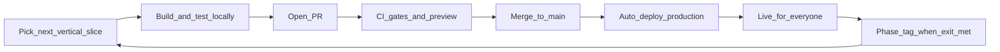
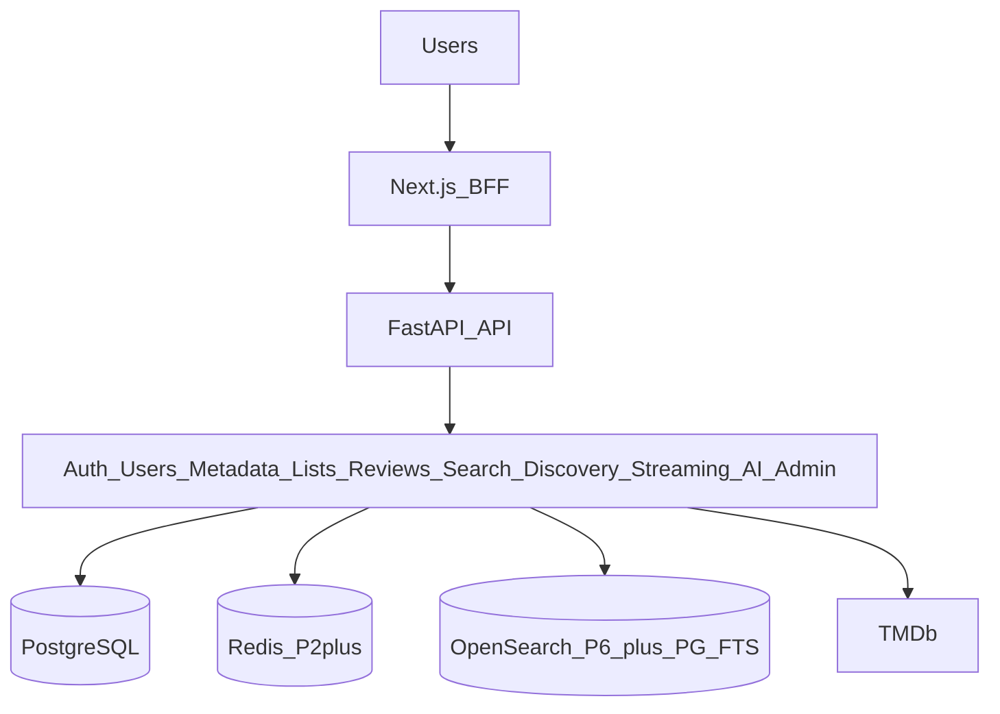
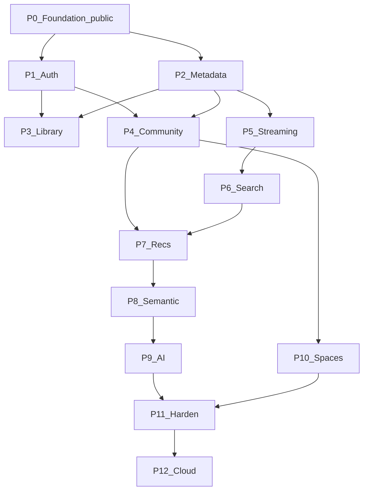

# Aperture Phase Implementation Plan

Ship Aperture as a continuous public product—iterate small vertical slices, test locally, pass CI/GitHub gates, deploy to the cloud for everyone, then start the next feature—while following Roadmap phases 0–12 and locked architecture defaults.

## Delivery model (primary approach)

Build and ship in a tight loop. The app is **publicly accessible from P0 onward**; later phases add features to a live product rather than waiting for a big-bang launch.

**Rules for every slice (not only every phase):**

1. **One user-visible increment** — e.g. “password login works end-to-end,” not “all of auth.”
2. **Local first** — `docker compose up`; unit/integration/API tests; smoke the happy path in the browser.
3. **PR + GitHub rules** — branch protection on `main`; required CI checks; no direct pushes; CODEOWNERS/PR template as needed.
4. **CI must be green** — lint, types, import-linter, Alembic single-head, tests, build, Docker image for backend.
5. **Preview** — Vercel preview per PR; backend preview/staging when available.
6. **Ship to production** — merge deploys FE (Vercel) + BE (Render) automatically; migrations run as part of deploy.
7. **Public URL stays up** — anyone with the link can use whatever has shipped so far (even if early phases are thin).
8. **Only then** start the next slice. Phase git tags (`v0.2.0`, etc.) mark when the *phase exit criteria* are met, after several shipped slices.

**What “slice” means inside a phase:** prefer vertical end-to-end cuts (schema → API → BFF → UI → tests → deploy) over horizontal layers (“finish all backend, then all frontend”).

**Non-negotiable quality bar while shipping fast:** same Definition of Done below; no “ship and fix CI later”; no secrets on the client; production DB backups from P0.

---

## Context

Repo is **docs-only** today ([docs/README.md](docs/README.md), PDFs under `docs/`). Product vision: [docs/Aperture PRD.pdf](docs/Aperture%20PRD.pdf). **Phase order/tags:** [docs/Aperture Development Roadmap.pdf](docs/Aperture%20Development%20Roadmap.pdf).

**Phase authority:** Roadmap wins over Playbook/LLD Index ordering (ADR-0001). Playbook becomes a practice guide (DoD, git, ship cadence).

**Stack (locked):** Next.js App Router + TS + Tailwind · FastAPI + SQLAlchemy 2.0 + Alembic + asyncpg · PostgreSQL · Redis from P2 · OpenSearch from P6 (PG FTS forever as fallback) · Vercel FE + Render BE/Postgres · modular monolith.

---

## Locked decisions (pre-code)

- Browser auth: same-origin **Next.js BFF**; `__Host-ap_at` / `__Host-ap_rt`; backend cookie-agnostic
- Tokens: 15m JWT access; opaque refresh + **10s reuse grace**; Argon2id
- OAuth: **no auto-link**; explicit link from settings; `identity_credentials`
- Rate limit from **P1**: CacheBackend + DB failed-attempt counters; Render **1 instance** until Redis
- P0 schema foundation: naming_convention, **UUIDv7**, mixins, single Alembic head CI gate
- Content: `content_items` + composite FK; seasons/episodes/people outside; `external_ids` UNIQUE `(source, source_namespace, external_id)`; unified cast/crew
- Public API: `/api/v1/movies|tv|people`; refs `{"type","id"}`
- Events: after-commit P1 (best-effort); outbox + **arq** P4
- Search: PG FTS P2 → composite OpenSearch+FTS P6
- Redis: **P2** intro (ADR supersedes Roadmap P11); P11 = harden

**ADRs (six):** phase authority · ORM/schema · hosting/BFF · content identity · auth · Redis/search staging.

**You supply:** domain (P0), paid Render budget (P0), Google OAuth (P1), TMDb key (P2), embedding provider (P8).

---

## Definition of Done (every shipped slice)

Local tests pass → PR CI green → preview OK → production deploy verified on the public URL → docs/ADR updated if needed. Layering via **import-linter**. Migrations reversible or documented; single Alembic head. AuthZ in service layer; axe/a11y baseline on touched UI; no secrets in git.

**Phase complete** only when roadmap exit criteria are met **and** a git tag + short release notes are published pointing at the live app.

---

## Phases as ship sequences

Each phase lists **ordered public slices**. Finish and deploy one before starting the next.

### P0 — Foundation `v0.1.0` (public skeleton)

| Slice | Ship when |
|---|---|
| P0.1 Scaffold | Monorepo, Makefile, uv/pnpm pins, empty apps start locally |
| P0.2 Local stack | Compose: FE + BE + Postgres; health roundtrip |
| P0.3 Quality gates | CI + branch protection + import-linter + Alembic head gate |
| P0.4 Schema foundation | Naming convention, UUIDv7, mixins, baseline migration |
| P0.5 BFF + shell UI | Tokens/a11y baseline; BFF proxy scaffolding |
| P0.6 Public cloud | Paid Render (always-on) + Postgres backups + Vercel; **public URL live** |

**Exit:** anyone can open the production URL and hit a healthy app; CI blocks bad merges; tag `v0.1.0`.

### P1 — User Platform `v0.2.0`

| Slice | Ship when |
|---|---|
| P1.1 Password auth | Register/login/logout/refresh on public URL |
| P1.2 Hardening | Rate limits, enumeration-safe errors, session reuse tests |
| P1.3 Google | Sign-in + authenticated account link |
| P1.4 Profiles | Username/bio/preferences/settings UI |

### P2 — Metadata `v0.3.0`

| Slice | Ship when |
|---|---|
| P2.1 Canonical catalog | `content_items`/`external_ids` + TMDb ingest for a seed set |
| P2.2 Detail UX | Movie/TV/person pages on production |
| P2.3 Search v1 | PG FTS across movies/TV/people |
| P2.4 Redis | Cache + multi-instance ready; document `watch_entries` for P3 |

### P3 — Personal Library `v0.4.0`

Ship: watchlist → favorites → custom lists/reorder → diary/`watch_entries` (each public).

### P4 — Reviews & Community `v0.5.0`

Ship: ratings → reviews/spoilers → likes/comments → follows → activity feed → outbox/arq/notifications.

### P5 — Streaming `v0.6.0`

Ship: provider ingest → badges on detail → region filter. Exit: OpenSearch host ADR-0007.

### P6 — Search `v0.7.0`

Ship: OpenSearch dual-write → autocomplete/facets → verified PG FTS fallback under outage test.

### P7–P10

Same cadence: P7 recs sections → P8 semantic → P9 Cinematic DNA / taste match → P10 spaces (create → discuss → moderate), each slice live before the next.

### P11 — Hardening `v1.2.0`

Still iterative and public: observability → load-test fixes → restore drill → OWASP fixes—ship improvements continuously, not a closed staging-only freeze.

### P12 — Cloud Evolution `v2.0.0`

Migrate to AWS/Terraform in cutover slices with rollback; keep the public product available throughout.

---

## Platform always-on (from P0)

- **GitHub:** `main` protected; required status checks; PR required; CI on every PR and on `main`.
- **Local:** Compose is the source of truth for day-to-day work; production-like env vars via `.env.example`.
- **Deploy:** merge to `main` → production; never “batch deploy after three phases.”
- **Migrations:** expand/migrate/contract friendly; run on deploy; backward-compatible with the currently live FE when possible.
- **Feature flags (lightweight):** optional env/DB flags when a slice must land dark; default is **ship visible** once tests pass.

---

## Dependency graph (phases)

Prefer **serial public slices** even when P1/P2 could parallelize—one shippable track unless a second contributor exists.

---

## Immediate kickoff

1. P0.1–P0.2: scaffold + local Compose roundtrip.
2. P0.3–P0.4: CI, branch protection, schema foundation.
3. P0.5–P0.6: BFF/shell + **first public deploy**; tag `v0.1.0`.
4. Start P1.1 (password auth) only after the public URL is verified.

---

## Accepted risks

- Pre-P4 events best-effort; OpenSearch host deferred to P5 exit; `render.yaml` until Terraform P12; docs updated in-phase to match ADRs.
- Early public releases will be incomplete by design—that is the product strategy, not a failure mode.

## Status

Plan approved for continuous public shipping. Implementation starts when explicitly requested (P0.1).
